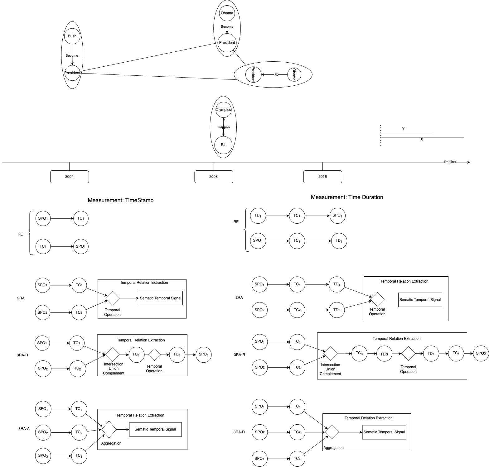
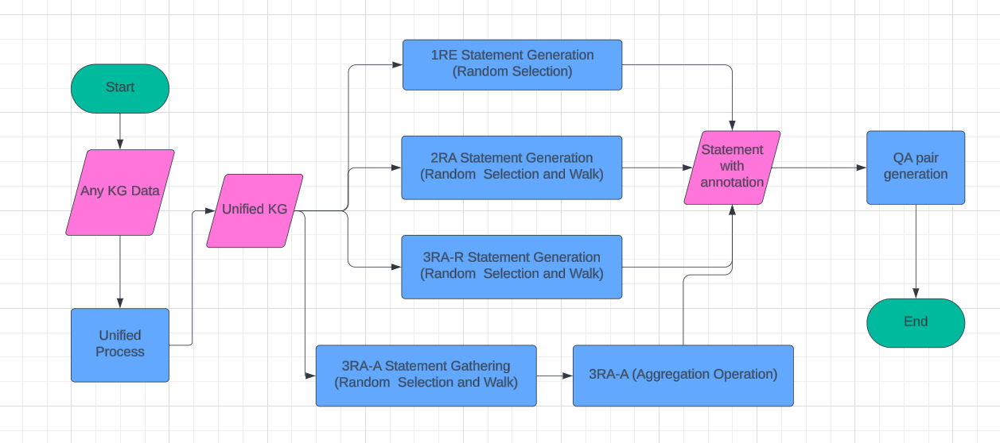

# TKGQA Generator

We plan to generate temporal question answering pairs from knowledge graphs from three different perspectives:

- **Temporal Logic**
- **Temporal Pattern**
- **Temporal Modifier**

Overall MindMap will be like this:


## Unified Knowledge Graph

There are a lot of ways to represent temporal information within the knowledge graph.
How should best represent the temporal information within knowledge graph?
I believe we do not have a clear conclusion here in the literature.

At the same time, the purpose of this project is to generate all possible types of the temporal question answering
pairs.
Therefore, the goal for us will be finding a way to efficiently represent the temporal information, also
generate the temporal statements for the question answering pairs.

So we propose to represent the temporal information as the attribute of a SPO triple NODE in our unified knowledge
graph.
This is similar to the event knowledge graph representation in the literature.

## Temporal Logic



The temporal questions can be classified into two categories based on the measurements:

- timestamp
- duration

From the logic perspective, we can decompose the temporal logic statements into two categories:

- Information Retrieval (**RE**)
- Reasoning (**RA**)
    - 2RA: which does temporal logic operation for two **Temporal Conditions (TC)**
    - 3RA: here we will compare three TCs
        - 3RA-R: Do Intersection/Union/Complement over two TCs, and then compare with the third TC
        - 3RA-A: Aggregate the three TCs and then compare with the fourth TC

The most complex queries are from the 3RA-R and 3RA-A categories.

### Workflow

The workflow of the temporal logic question answering pairs over knowledge graph is as follows:

1. **Unified Knowledge Graph**: Transform the knowledge graph into a unified format, where **SPO** are nodes,
   and [start_time, end_time] are attributes.
2. **Generate TRUE Temporal Logic Statement**:
    - 1RE
    - 2RA
    - 3RA-R
    - 3RA-A
3. Generate QA pairs with templates



## Development Setup

### Install the package

```bash
# cd to current directory
cd tkgqa_generator
pip install -r requirements.txt
# if you are doing development
pip install -r requirements.dev.txt

# and then install the package
pip install -e .
```

### Folder Structure

```bash
tkgqa_generator/
├── tkgqa_generator/
│   ├── __init__.py
│   ├── generator.py
│   ├── processor.py
│   └── utils.py
├── tests/
│   ├── __init__.py
│   ├── test_generator.py
│   └── test_processor.py
├── docs/
│   └── ...
├── examples/
│   └── basic_usage.py
├── setup.py
├── requirements.txt
├── README.md
└── LICENSE
```
