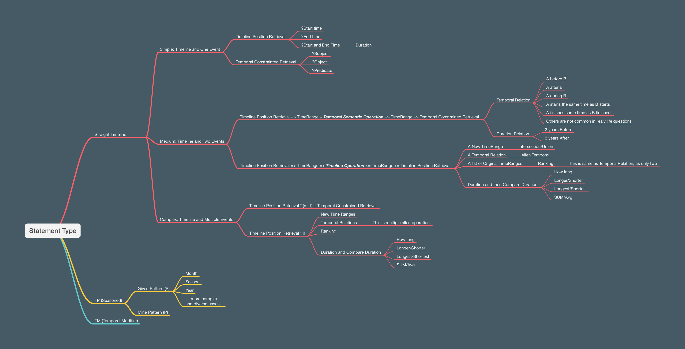

# TKGQA Generator

We plan to generate temporal question answering pairs from knowledge graphs from three different perspectives:

- **Temporal Logic**
- **Temporal Pattern**
- **Temporal Modifier**

Overall MindMap will be like this:



## Unified Knowledge Graph

There are a lot of ways to represent temporal information within the knowledge graph.
How should best represent the temporal information within knowledge graph?
I believe we do not have a clear conclusion here in the literature.

At the same time, the purpose of this project is to generate all possible types of the temporal question answering
pairs.
Therefore, the goal for us will be finding a way to efficiently represent the temporal information, also
generate the temporal statements for the question answering pairs.

So we propose to represent the temporal information as the attribute of a SPO triple NODE in our unified knowledge
graph.
This is similar to the event knowledge graph representation in the literature.

## Temporal Logic


The temporal questions can be classified into two categories based on the measurements:

- timestamp
- duration

From the logic perspective, we can decompose the temporal logic statements into two categories:

- Information Retrieval (**RE**)
- Reasoning (**RA**)
    - 2RA: which does temporal logic operation for two **Temporal Conditions (TC)**
    - 3RA: here we will compare three TCs
        - 3RA-R: Do Intersection/Union/Complement over two TCs, and then compare with the third TC
        - 3RA-A: Aggregate the three TCs and then compare with the fourth TC

The most complex queries are from the 3RA-R and 3RA-A categories.

### Workflow

The workflow of the temporal logic question answering pairs over knowledge graph is as follows:

1. **Unified Knowledge Graph**: Transform the knowledge graph into a unified format, where **SPO** are nodes,
   and [start_time, end_time] are attributes.
2. **Generate TRUE Temporal Logic Statement**:
    - 1RE
    - 2RA
    - 3RA-R
    - 3RA-A
3. Generate QA pairs with templates


## Datasets

We are exploring the following datasets for the temporal question answering pairs:

- [ICEWS](./docs/data/ICEWS.md)

## Development Setup

### Install the package

```bash
# cd to current directory
cd tkgqa_generator
pip install -r requirements.txt
# if you are doing development
pip install -r requirements.dev.txt

# and then install the package
pip install -e .
```

If you are doing development, you will also need a database to store the knowledge graph.

```bash
# spin up the database
docker-compose up -d
```

### Folder Structure

```bash
tkgqa_generator/
├── tkgqa_generator/
│   ├── __init__.py
│   ├── generator.py
│   ├── processor.py
│   └── utils.py
├── tests/
│   ├── __init__.py
│   ├── test_generator.py
│   └── test_processor.py
├── docs/
│   └── ...
├── examples/
│   └── basic_usage.py
├── setup.py
├── requirements.txt
├── README.md
└── LICENSE
```

# How human handle the temporal information and answer the temporal questions?

## Information Indexing

When we see something, for example, an accident happen near our home in today morning.
We need to first index this event into our brain.
As we live in a three dimension space together with a time dimension,
when we want to store this in our memory, (we will treat our memory as a N dimension space)

- Index the spatial dimensions: is this close to my home or close to one of the point of interest in my mind
- Index the temporal dimension: Temporal have several aspects
    - Treat temporal as **Straight Homogenous(Objective)** Timeline: Exact date when it happen, for
      example, [2023-05-01 10:00:00, 2023-05-01 10:30:00]
    - Treat temporal as **Cycle Homogenous(Objective)** Timeline: Monday, First day of Month, Spring, 21st Century,
      etc. (You
      can aslo cycle the timeline based on your own requirement)
    - Treat temporal as **Straight Hoterogenous(Subjective)** Timeline: If you sleep during night, it will be fast for
      you in
      the 8 hours, however, if someone is working overnight, time will be slow for him.
    - Treat temporal as **Cycle Hoterogenous(Subjective)** Timeline: Life has different turning points for everyone,
      until they
      reach the end of their life.
- Then index the information part: What happen, who is involved, what is the impact, etc.

So in summary, we can say that in our mind, if we treat the event as embedding in our human mind:

- part of the embedding will represent the temporal dimension information,
- part of the embedding will represent the spatial dimension information,
- the rest of the embedding will represent the general information part.

This will help us to retrieve the information when we need it.

## Information Retrieval

So when we try to retrieval the information, espeically the temporal part of the information.
Normally we have several types:

- Timeline Recovery: When Bush starts his term as president of US?
    - First: **General Information Retrieval** [(Bush, start, president of US), (Bush, term, president of US)]
    - Second: **Timeline Recovery Retrieval
      ** [(Bush, start, president of US, 2000, 2000), (Bush, term, president of US, 2000, 2008)]
    - Third: Answer the question based on the timeline information
- Temporal Constrainted Retrieval: In 2009, who is the president of US?
    - First: **General Information Retrieval
      ** [(Bush, president of US), (Obama, president of US), (Trump, president of US)]
    - Second: **Temporal Constraint Retrieval** [(Obama, president of US, 2009, 2016)]
    - Third: Answer the question based on the temporal constraint information

Three key things here:

- **General Information Retrieval**: Retrieve the general information from the knowledge graph based on the question
- **Temporal Constrainted Retrieval**: Filter on general information retrieval, apply the temporal constraint
- **Timeline Recovery Retrieval**: Based on general information retrieval, recover the timeline information

## Temporal Questions

We can try to classify the temporal questions from quite a few perspectives:

- Based on Answer: Entity, Temporal
- Based on Temporal Relations in Question: Before, After, During , etc or First, Last, etc.
- Based on Temporal Representation Type: Point, Range, Duration, etc.
- Based on Complexity of Question: Simple (direct retrieval), Complex (Multiple hops with the three key things we
  mention above)

There is still no agreement or clear classification here, most of them stays in the first two.
However, it is obvious that they have overlaps, so will not be the best way to advance the temporal embedding
algorithms development.

We are trying to decompose the question into the three key parts we mentioned above, so we can evaluate the ability of
the models for this three key capabilities.

### Simple: Timeline and One Event Involved

- Timeline Recovery: When Bush starts his term as president of US?
    - General Information Retrieval => Timeline Recovery => Answer the question
    - Question Focus can be: Timestamp Start, Timestamp End, Duration, Timestamp Start and End
- Temporal Constrainted Retrieval: In 2009, who is the president of US?
    - General Information Retrieval => Temporal Constraint Retrieval => Answer the question
    - Question Focus can be: Subject, Object, Predicate. Can be more complex if we want mask out more elements

### Medium: Timeline and Two Events Involved

- Timeline Recovery + Timeline Recovery: Is Bush president of US when 911 happen?
    - (General Information Retrieval => Timeline Recovery) And (General Information Retrieval => Timeline
      Recovery) => Timeline Operation => Answer the question
    - Question Focus can be: A new Time Range, A temporal relation (Before, After, During, etc.), A list of Time
      Range (Ranking), or Comparison of Duration
- Timeline Recovery + Temporal Constrainted Retrieval: When Bush is president of US, who is the president of China?
    - (General Information Retrieval => Timeline Recovery) => Temporal Constraint Retrieval => Answer the question
    - This is same as above, Question Focus can be: Subject, Object

### Complex: Timeline and Multiple Events Involved

In general, question focus (answer type) will only be two types when we extend from Medium Level

- Timeline Operation
- (Subject, Predicate, Object)

So if we say Complex is 3 events and Timeline.

- Timeline Recovery + Timeline Recovery + Timeline Recovery: When Bush is president of US and Putin is President of
  Russion, is Hu the president of China?
    - (General Information Retrieval => Timeline Recovery) And (General Information Retrieval => Timeline Recovery)
      And (General Information Retrieval => Timeline Recovery) => Timeline Operation => Answer the question
- Timeline Recovery + Timeline Recovery + Temporal Constrainted Retrieval: When Bush is president of US and Putin is
  President of Russion, who is the president of China?
    - (General Information Retrieval => Timeline Recovery) And (General Information Retrieval => Timeline Recovery)
      And (General Information Retrieval => Temporal Constraint Retrieval) => Timeline Operation => Answer the question 