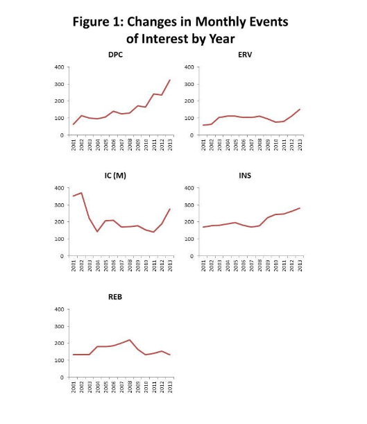
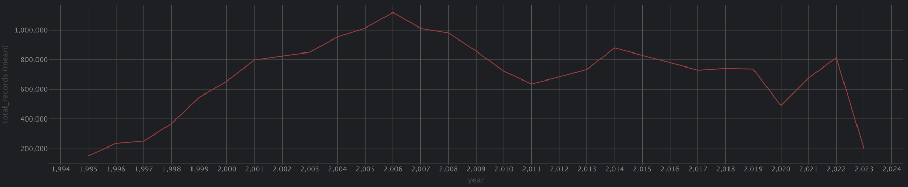
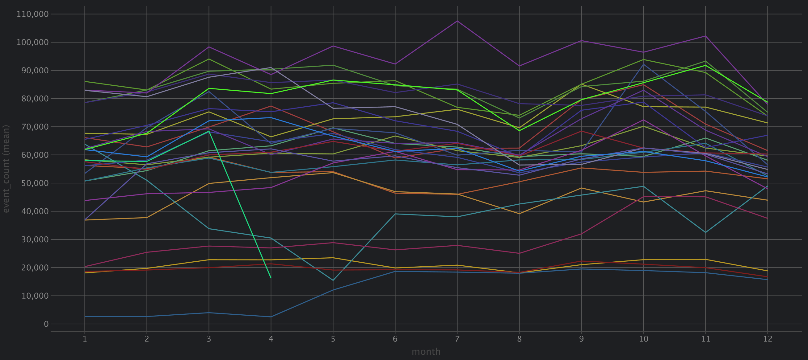
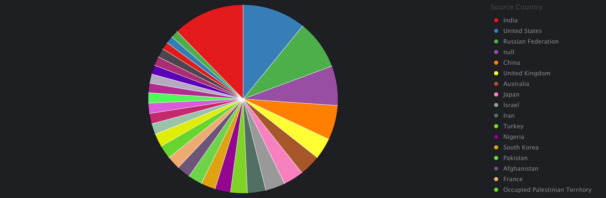
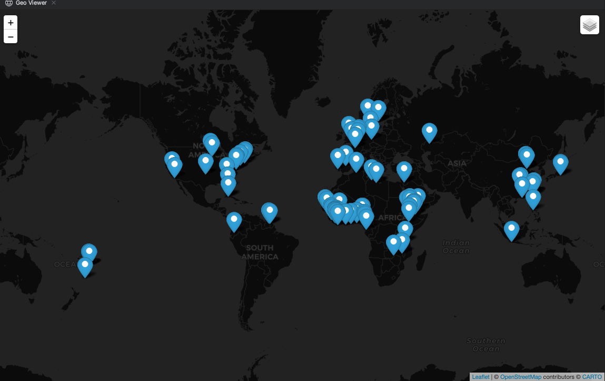
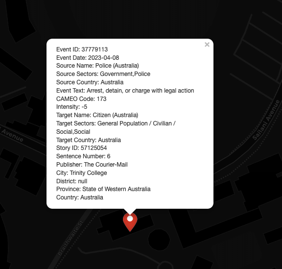
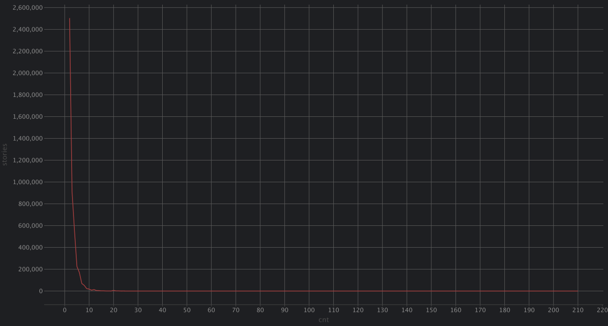
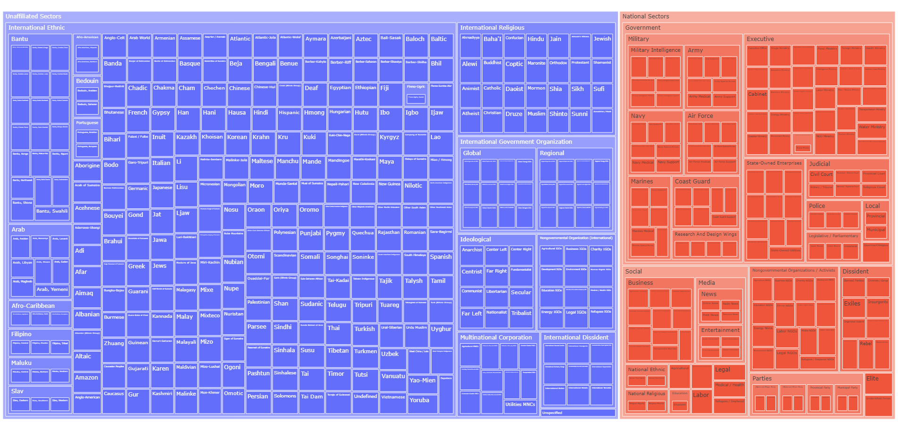
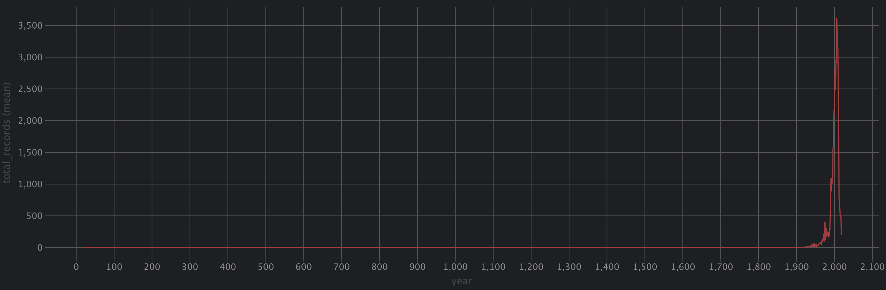
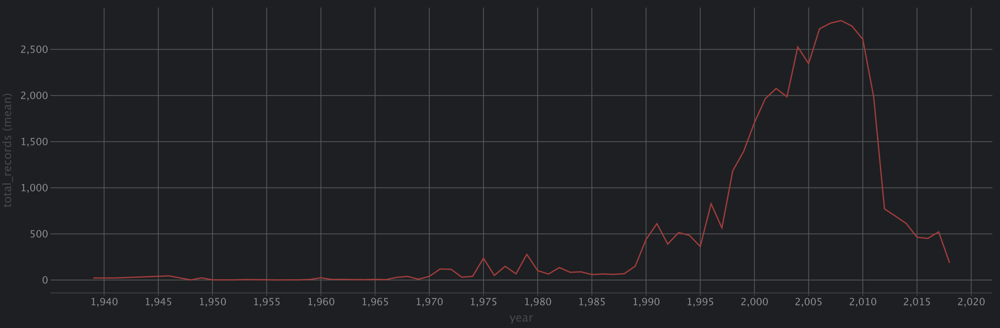

# ICEWS

Integrated Crisis Early Warning System

Data download link: [ICEWS](https://dataverse.harvard.edu/dataverse/icews)

There are four links there, two of them are deprecated, which are:

- ICEWS Event Aggregations
    - Which want to aggregate the events into a monthly basis
- ICEWS Events of Interest Ground Truth Data Set
    - Rather than from the temporal aspect to aggregate the events
    - this is used to aggregate the events from a semantic
      aspect
    - With the latest advanced in LLM, I will say this can be done via semantic retrieval
    - 

Both of them were deprecated in 2015.

ICEWS Dictionaries are kind of ontology of the datasets, which is still useful.
The core event data is the ICEWS Events data, which is from this
link: [ICEWS Events](https://dataverse.harvard.edu/dataset.xhtml?persistentId=doi:10.7910/DVN/28075)

## Exploration of the data

The data spanned from 1995 to 2023 now.

### SQL Exploration

#### Total number of events

```sql
SELECT COUNT(*)
FROM icews;
-- Results: 18662558
```

#### For each year, the number of events

```sql
SELECT EXTRACT(YEAR FROM CAST("Event Date" AS DATE)) AS year, COUNT(*) AS total_records
FROM icews
GROUP BY EXTRACT(YEAR FROM CAST("Event Date" AS DATE))
ORDER BY year;
```



#### For each year, each month, the number of events

```sql
SELECT EXTRACT(YEAR FROM CAST("Event Date" AS DATE))  AS year,
       EXTRACT(MONTH FROM CAST("Event Date" AS DATE)) AS month,
       COUNT(*)                                       AS event_count
FROM icews
GROUP BY year, month
ORDER BY year, month;
```



#### Sector Distribution

```sql

SELECT "Source Sectors", COUNT(*) AS total_records
FROM icews
GROUP BY "Source Sectors"
ORDER BY total_records DESC;
```

Majority of the events are from the `null` sector, which means no source sector assigned, the number is 4315622.
A lot of events are from multiple sectors.
Other than that, top sections include

```csv
"General Population / Civilian / Social,Social",540124
"Government,Police",501993
"Social,General Population / Civilian / Social",481059
"Police,Government",412783
"Government,Military",353416
"Military,Government",277339
Unidentified Forces,203532
"Government,Legislative / Parliamentary",170821
"Executive,Executive Office,Government",148222
"Dissident,Protestors / Popular Opposition / Mobs",145254
"Government,Judicial",135696
"Legislative / Parliamentary,Government",133953
Parties,133178
```

#### Country event distribution

```sql
SELECT "Country", COUNT(*) AS total_records
FROM icews
GROUP BY "Country"
ORDER BY total_records DESC;
```

254 Countries/Regions, the top 10 countries are:

```csv
India,1584754
Russian Federation,1107847
United States,1027424
China,820521
United Kingdom,505387
Australia,453535
Japan,444193
Iran,429701
Occupied Palestinian Territory,369623
Iraq,367640
```



#### Event text distribution (edge)

```sql
SELECT COUNT(*), "Event Text"
FROM icews
GROUP BY "Event Text"
ORDER BY COUNT(*) DESC
LIMIT 30;
```

In total we have 273 Event Texts, the top 30 are:
```csv
3080611,Make statement
2071970,Consult
1230464,Express intent to meet or negotiate
1145847,Make a visit
1145812,Host a visit
884206,Make an appeal or request
825543,"Arrest, detain, or charge with legal action"
680572,Praise or endorse
579460,Criticize or denounce
522472,Use conventional military force
462241,Accuse
444268,Engage in negotiation
380198,Use unconventional violence
355367,Demonstrate or rally
351145,Sign formal agreement
286431,Express intent to cooperate
271811,Express intent to engage in diplomatic cooperation (such as policy support)
270530,Engage in diplomatic cooperation
230565,Demand
203805,fight with small arms and light weapons
198600,Reject
182051,Investigate
149900,Make optimistic comment
136411,Discuss by telephone
108548,Threaten
99449,Make pessimistic comment
85663,Engage in symbolic act
81941,Meet at a 'third' location
79850,"Return, release person(s)"
77621,"Abduct, hijack, or take hostage"
```

#### Convert to GPS and plot on the map

```sql
ALTER TABLE icews
    ADD COLUMN geom geometry(Point, 4326);
UPDATE icews
SET geom = ST_SetSRID(ST_MakePoint(Longitude, Latitude), 4326);
```



#### All events from Australia

```sql
SELECT *
FROM icews
WHERE "Country" = 'Australia';
```

#### One example of the event

```
SELECT *
FROM icews
WHERE "Story ID" = '57125054';
```



#### Story ID distribution

```sql
SELECT cnt, COUNT(*) AS stories
FROM (SELECT "Story ID", COUNT(*) AS cnt
      FROM icews
      GROUP BY "Story ID"
      HAVING COUNT(*) > 1) AS duplicate_stories
GROUP BY cnt
ORDER BY cnt;
```



#### Get count for unique source name and target name

```sql
SELECT "Source Name", COUNT(*) AS source_count
FROM icews
GROUP BY "Source Name"
ORDER BY source_count DESC;
```

```sql
SELECT "Target Name", COUNT(*) AS target_count
FROM icews
GROUP BY "Target Name"
ORDER BY target_count DESC;
```

### Sector/Agents/Actor

#### Number of Sector/Agen/Actor

```sql
SELECT COUNT(*)
FROM icews_sectors;
-- 590
SELECT COUNT(*)
FROM icews_agents;
-- 701
SELECT COUNT(*)
FROM icews_actors
-- 108005
```

#### Sector data

For the sector tree, visualization is like this:



#### Actor data

This should be the temporal duration data we are looking for.

The columns are

- Country
- Actor Name
- Actor Type
- Affiliation to
- Affiliation Start Date
- Affiliation End Date
- Aliases

For each year, how many actors are starting

```sql
SELECT EXTRACT(YEAR FROM CAST("Affiliation Start Date" AS DATE)) AS year, COUNT(*) AS total_records
FROM icews_actors
WHERE "Affiliation Start Date" != 'beginning of time'
  and EXTRACT(YEAR FROM CAST("Affiliation Start Date" AS DATE)) < 2030
GROUP BY EXTRACT(YEAR FROM CAST("Affiliation Start Date" AS DATE))
ORDER BY year;
```

```sql
SELECT EXTRACT(YEAR FROM CAST("Affiliation End Date" AS DATE)) AS year, COUNT(*) AS total_records
FROM icews_actors
WHERE "Affiliation End Date" != 'end of time'
  and EXTRACT(YEAR FROM CAST("Affiliation End Date" AS DATE)) < 2040
GROUP BY EXTRACT(YEAR FROM CAST("Affiliation End Date" AS DATE))
ORDER BY year;
```





```sql
SELECT COUNT(*), "Country"
FROM icews_actors
GROUP BY "Country";
-- 4557,United States
-- 4458,India
-- 3988,Multi-National Corporations
-- 2742,Bangladesh
-- 2191,United Kingdom
-- 1716,Non-Governmental Organizations
-- 1694,Russian Federation
-- 1299,South Africa
-- 1299,France
-- 1293,Mexico
-- 1290,Cambodia
-- 1289,Nigeria
-- 1252,Chile
-- 1199,Argentina
-- 1182,Brazil
-- 1166,Colombia
-- 1159,Canada
-- 1067,Iran
```

```sql
SELECT COUNT(*), icews_actors."Actor Type"
FROM icews_actors
GROUP BY icews_actors."Actor Type";
-- 84923,Individual
-- 23082,Group
```

### Problems

The entity does not have conservative stories.

## Download data

Data is available within the link above, or this
link: [ICEWS Events](https://pascalsun.sg4.quickconnect.to/d/s/xkoI2xvSvWopVqbmdNQ0wQxh5JwknS8K/FByRCtROPpmYWCpleIfh_LAL1wc6Lysb-grMgdjDqOws)

The file we focus on will be `ICEWS Coded Event Data`

Put them into the folder `data/ICEWS`

Do the same for `ICEWS Dictionaries

The structure of the data is as follows:

```bash
├── data/
│   └── icews/
│      │── ICEWS Coded Event Data/
│      └── ICEWS Dictionaries/
```

