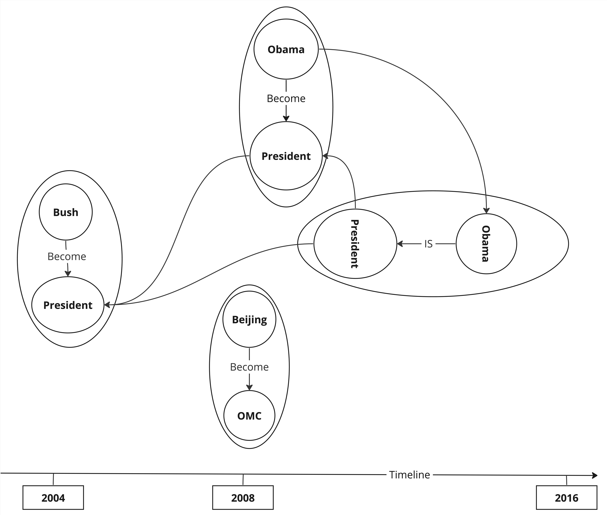
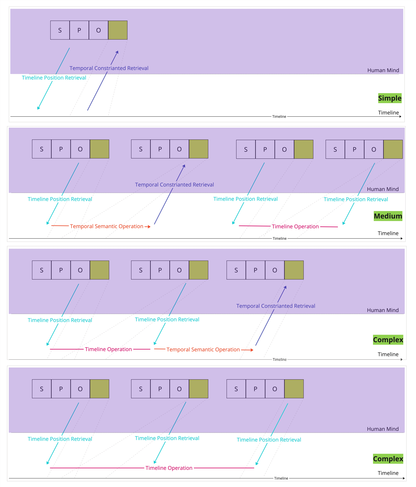

# EventTimeline QA

---

## How human handle temporal information?

### Information Indexing

When we see something, for example, an accident happen near our home in today morning.
We need to first index this event into our brain.
As we live in a three dimension space together with a time dimension,
when we want to store this in our memory, (we will treat our memory as a N dimension space).

1. Index the spatial dimensions:
    - Is this close to my home or close to one of the point of interest in my mind
2. Index several temporal dimension:
    - Treat temporal as **Straight Homogenous(*Objective*)** Timeline:
        - Exact date when it happen, for example, [2023-05-01 10:00:00, 2023-05-01 10:30:00]
    - Treat temporal as **Cycle Homogenous(*Objective*)** Timeline:
        - Monday, First day of Month, Spring, 21st Century, etc.
        - (You can aslo cycle the timeline based on your own requirement)
    - Treat temporal as **Straight Hoterogenous(*Subjective*)** Timeline:
        - If you sleep during night, it will be fast for you in the 8 hours, however, if someone is working overnight,
          time will be slow for him.
    - Treat temporal as **Cycle Hoterogenous(*Subjective*)** Timeline:
        - Life has different turning points or milestones for each individual, until they reach the end of their life.
3. Then index the information part:
    - What happen
    - Who is involved
    - What is the impact
    - etc.

So in summary, we can say that in our mind, if we also store the event as embeddings in our human mind:

- part of the embedding will represent the temporal dimension information,
- part of the embedding will represent the spatial dimension information,
- the rest of the embedding will represent the general information part.

This will help us to retrieve the information when we need it.

### Information Retrieval

So when we try to retrieval the information, espeically the temporal part of the information.
Normally we have several types:

- **Timeline Position Retrieval**:
    - When Bush starts his term as president of US?
        - First: **General Information Retrieval**  => [(Bush, start, president of US), (Bush, term, president of US)]
        - Second: **Timeline Position Retrieval** => [(Bush, start, president of US, 2000, 2000),
          (Bush, term, president of US, 2000, 2008)]
        - Third: Answer the question based on the timeline information
- **Temporal Constrainted Retrieval**:
    - In 2009, who is the president of US?
        - First: **General Information Retrieval**  => [(Bush, president of US),
          (Obama, president of US), (Trump, president of US)]
        - Second: **Temporal Constraint Retrieval** => [(Obama, president of US, 2009, 2016)]
        - Third: Answer the question based on the temporal constraint information

Three key **Retrieval** include:

- **General Information Retrieval**: Retrieve the general information from the knowledge graph based on the question
- **Temporal Constrainted Retrieval**: Filter on general information retrieval, apply the temporal constraint
- **Timeline Position Retrieval**: Based on general information retrieval, recover the timeline information

---

## Unified Knowledge Graph

There are a lot of ways to represent temporal information within the knowledge graph.
How should best represent the temporal information within knowledge graph?
I believe we do not have a clear conclusion here in the literature.

At the same time, the purpose of this project is to generate all possible types of the temporal question answering
pairs.
Therefore, the goal for us will be finding a way to efficiently represent the temporal information, also
generate the temporal statements for the question answering pairs.

So we propose to represent the temporal information as the attribute of a SPO triple NODE in our unified knowledge
graph.
This is similar to the event knowledge graph representation in the literature.

The Node we have within the **Unified Knowledge Graph** will be:

- **SPO**: Subject, Predicate, Object together to form a node
- **Time**: [start_time, end_time] as the attribute of the node

As shown in the following figure:



In this way, we can align all the events along the timeline, and do the temporal operations on the timeline.

---

## Temporal Questions Classification

In this case, if we want to handle the Temporal Questions in the knowledge graph, we have four types of timelines.

Here we only consider the **Straight Homogenous(*Objective*)** Timeline.

As shown in the following figure:



Based on the complexity of the question, we can classify the temporal questions into three levels:

- **Simple**: Timeline and One Event Involved
- **Medium**: Timeline and Two Events Involved
- **Complex**: Timeline and Multiple Events Involved

### Simple: Timeline and One Event Involved

Under this category, the question will be simple, and only one event involved.

- Timeline Position Retrieval:
    - When we was given the event, we will want to clarify the timeline position of the event.
    - And then we can answer the question based on the timeline position of the event.
    - For example: *When Bush starts his term as president of US?*
        - General Information Retrieval => Timeline Position Retrieval => Answer the question
- Temporal Constrainted Retrieval:
    - When we was given the time range, we will want to clarify the event within the time range.
    - And then we can answer the question based on the event within the time range.
    - For example: *In 2009, who is the president of US?*
        - General Information Retrieval => Temporal Constraint Retrieval => Answer the question

Most of the questions in the literature are in this category.

### Medium: Timeline and Two Events Involved

We will need to compare the events from temporal perspective.

- Timeline Position Retrieval + Timeline Position Retrieval:
    - Is Bush president of US when 911 happen?
        1. *(General Information Retrieval => Timeline Position Retrieval)*
        2. *(General Information Retrieval => Timeline Position Retrieval)*
        3. *Timeline Operation* => Answer the question
- Timeline Position Retrieval + Temporal Constrainted Retrieval:
    - Who is the president of US when 911 happen?
        1. *(General Information Retrieval => Timeline Position Retrieval)*
        2. *(General Information Retrieval => Temporal Constraint Retrieval)*
        3. *Temporal Semantic Operation* => Answer the question

Here we introudce two key operations:

- **Timeline Operation**: From numeric to semantic
    - Infer a new time range based on two time ranges (Intersection, Union)
    - Infer a semantic temporal relationship based on two time ranges (Before, After, Overlap, Allen Temporal
      Relationship)
    - Infer a list of time ranges based on two time ranges (Ranking)
    - Infer the duration of time range, and then compare the duration
        - Duration relationships (Shorter, Longer, Equal)
- **Temporal Semantic Operation**: From Semantic to Numeric
    - Given a time range and a semantic temporal relationship, infer the new time range

These two key operations are the key ability required for the medium level questions.

### Complex: Timeline and Multiple Events Involved

Let's say the multiple is **3**.
Derived from the medium level questions, we mainly have two types of questions:

- Timeline Position Retrieval + Timeline Position Retrieval + Timeline Position Retrieval:
    - Is Bush president of US when 911 happen and when the financial crisis happen?
        1. *(General Information Retrieval => Timeline Position Retrieval)*
        2. *(General Information Retrieval => Timeline Position Retrieval)*
        3. *(General Information Retrieval => Timeline Position Retrieval)*
        4. *Timeline Operation* => Answer the question
- Timeline Position Retrieval + Timeline Position Retrieval + Temporal Constrainted Retrieval:
    - Who is the president of US when 911 happen and when the financial crisis happen?
        1. *(General Information Retrieval => Timeline Position Retrieval)*
        2. *(General Information Retrieval => Timeline Position Retrieval)*
        3. *(General Information Retrieval => Temporal Constraint Retrieval)*
        4. *Temporal Semantic Operation* => Answer the question

We can find that the key ability required for the complex level questions are the same as the medium level questions.

### Key ability required

- **General Information Retrieval**: Retrieve the general information from the knowledge graph based on the question
- **Temporal Constrainted Retrieval**: Filter on general information retrieval, apply the temporal constraint
- **Timeline Position Retrieval**: Based on general information retrieval, recover the timeline information
- **Timeline Operation**: From numeric to semantic
- **Temporal Semantic Operation**: From Semantic to Numeric

## Workflow

The workflow of the temporal logic question answering pairs over knowledge graph is as follows:

1. **Unified Knowledge Graph**: Transform the knowledge graph into a unified format, where **SPO** are nodes,
   and [start_time, end_time] are attributes.
2. Generate questions based on the template, then use LLM to get it more natural.
    - **Simple**
    - **Medium**
    - **Complex**

## Datasets

We are exploring the following datasets for the temporal question answering pairs:

- [ICEWS](./data/ICEWS.md)

## Development Setup

### Install the package

```bash
# cd to current directory
cd tkgqa_generator
pip install -r requirements.txt
# if you are doing development
pip install -r requirements.dev.txt

# and then install the package
pip install -e .
```

If you are doing development, you will also need a database to store the knowledge graph.

```bash
# spin up the database
docker-compose up -d
```

### Folder Structure

```bash
tkgqa_generator/
├── tkgqa_generator/
│   ├── __init__.py
│   ├── generator.py
│   ├── processor.py
│   └── utils.py
├── tests/
│   ├── __init__.py
│   ├── test_generator.py
│   └── test_processor.py
├── docs/
│   └── ...
├── examples/
│   └── basic_usage.py
├── setup.py
├── requirements.txt
├── README.md
└── LICENSE
```

# Note:

How old roughly is my Grandfather?